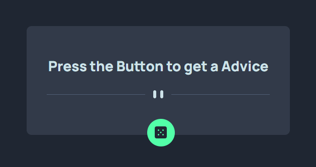

# Advice generator app

This is a solution to
the [Advice generator app challenge on Frontend Mentor](https://www.frontendmentor.io/challenges/advice-generator-app-QdUG-13db).
Frontend Mentor challenges help you improve your coding skills by building realistic projects.

## Table of contents

- [Overview](#overview)
    - [The challenge](#the-challenge)
    - [Screenshot](#screenshot)
    - [Links](#links)
- [My process](#my-process)
    - [Built with](#built-with)
    - [What I learned](#what-i-learned)
- [Author](#author)

## Overview

### The challenge

Users should be able to:

- View the optimal layout for the app depending on their device's screen size
- See hover states for all interactive elements on the page
- Generate a new piece of advice by clicking the dice icon

### Screenshot

### Links

- Solution URL: [Here]()
- Live Site URL: [Here](https://adviceforfree.netlify.app/)

## My process

### Built with

- Mobile-first workflow
- [React](https://reactjs.org/) - JS library
- css

### What I learned

Practiced to use state hooks to store and render data and display elements based on the state.

## Author

- Website - [Naveen](https://naveenp.dev/)
- github - [@naveen-p08](https://www.frontendmentor.io/profile/yourusername)
- Twitter - [@naveen_p08](https://twitter.com/naveen_p08)

